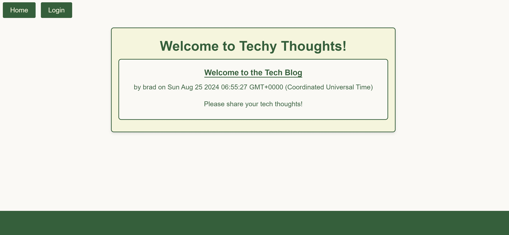

# Techy Thoughts

## Project Title
Techy Thoughts 

## Description
A blog site designed for developers to publish blog posts and comment on others. The application allows users to perform CRUD operations on blog posts and comments. The user can create an account where they will have their own dashboard that stores their comments. From there, they can edit and delete their comments. The main homepage shows their posts as well as post by others.

## Table of Contents
* [Install](#installation)
* [Usage](#usage)
* [License](#license)
* [Links](#links)
* [Contribution](#contributions)
* [Tests](#tests)
* [Questions](#questions)

## Installation
After cloning the repo, run npm install. Set up your .env file with your credentials. Seed the database with npm run seed. Then you should be good to go with npm start.

## Usage
Once the server is running and you are on the website you find multiple uses. The first is created an accoud so you can share your epic tech thoughts with fellow users by navigating to the login in page and then signing up. After that you can make your way to the homepage where you can review other tech posts and provide comments! Anytime you feel that you no longer want your post on the homepage or need to edit something, feel free to do so by navigating to your dashboard and deleting or editing your post.

## License
ISC

## Links
[GitHub Repo](https://github.com/bragonese1/techy-thoughts)
 
[Deployed Render Site](https://techy-thoughts.onrender.com)

## Contributions
Helpful sites that contributed to this project.

* [W3Schools](https://www.w3schools.com/)
* [Stack Overflow](https://stackoverflow.com/)
* [MDN Web Docs](https://developer.mozilla.org/en-US/)
* [CSS-Tricks](https://css-tricks.com/)

Peer Help:
* [Barrett](https://github.com/bmist41)

If you would like to contribute to Techy Thoughts, please fork the repository and submit a pull request with your changes. Contributions are welcome!

## Tests
N/A

## Questions
- Contact Me for Questions:
[GitHub](https://github.com/bragonese1) | [Email](mailto:ragonesebradley@gmail.com)